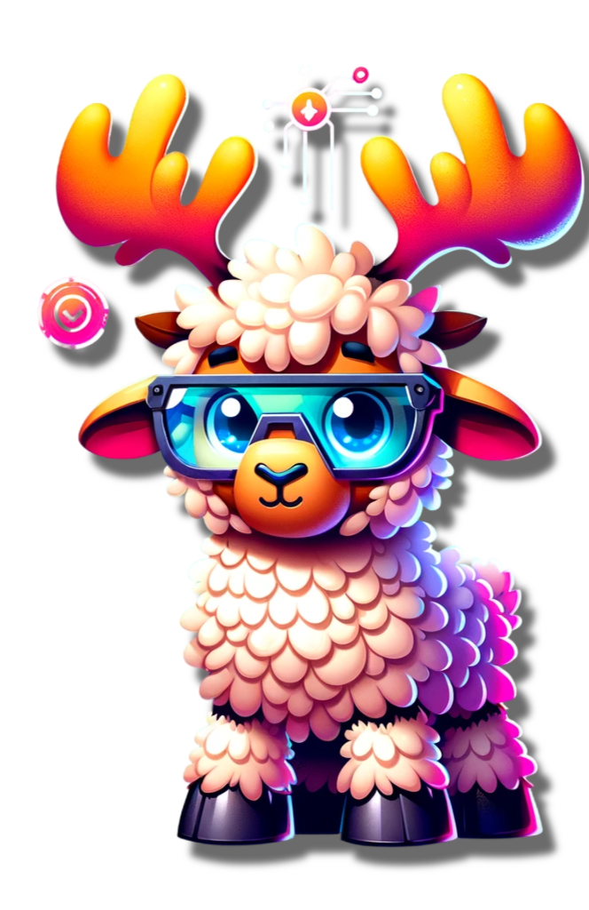

<!-- Title -->
# Hello, Universe! 🌌

<!-- Introduction -->
I'm a frontend-focused fullstack software engineer hailing from the vibrant city of Los Angeles. Formerly a medical student, I followed my true passion for technology into the world of coding. 🏥 ➡️ 💻

<!-- Technologies -->
## 💻 Technologies & Skills
- JavaScript (ES6+)
- Node.js
- TypeScript
- AWS 🌐
- Next.js
- Express.js
- jQuery
- HTML5
- CSS3
- SASS/SCSS
- LESS
- Tailwind CSS
- React.js
- Bootstrap
- Svelte
- WordPress
- Webpack
- Git/GitHub
- SQL Databases 📊
- MongoDB 🍃
- PHP
- OAuth
- GraphQL 🚀

<!-- Interests -->
## 🎮 Hobbies & Interests
- I'm a huge nerd who loves video games and board games. 🎮🎲
- I'm a musical enthusiast, and you can often find me at music concerts or enjoying the latest musicals. 🎵🎭
- When it comes to tech, I can talk for hours about anything and everything related to it! 💬💻

<!-- Diversity and Inclusion -->
## 🌈 Embracing Diversity
As a proud member of the LGBTQ+ community and a person of South Asian descent from Pakistan, I believe in the power of diversity in the tech world. 🏳️‍🌈🌍 Let's celebrate our differences and create an inclusive tech community for all!

<!-- Achievements -->
## 🏆 Achievements
- Former college speech and debate champion with several state and national-level awards. 🏅🎙️

<!-- Contact -->
## 📫 Get in Touch
Feel free to connect with me on [LinkedIn](https://www.linkedin.com/in/](https://www.linkedin.com/in/umair-w-shafiq/) or [My Website](https://umair-portfolio-two.vercel.app/). You can also reach me via email at [mailto:umairshafiqprof@gmail.com]. Let's chat about tech, games, or anything that piques your interest! 📧🌐

<!-- Visuals -->

  

<audio controls aligh="center">
  <source src="https://your-audio-hosting-link.com/your-audio-file.mp3" type="audio/mpeg">
  Your browser does not support the audio element.
</audio>
<!-- Footer -->

Designed with 💖 by Umair Shafiq

